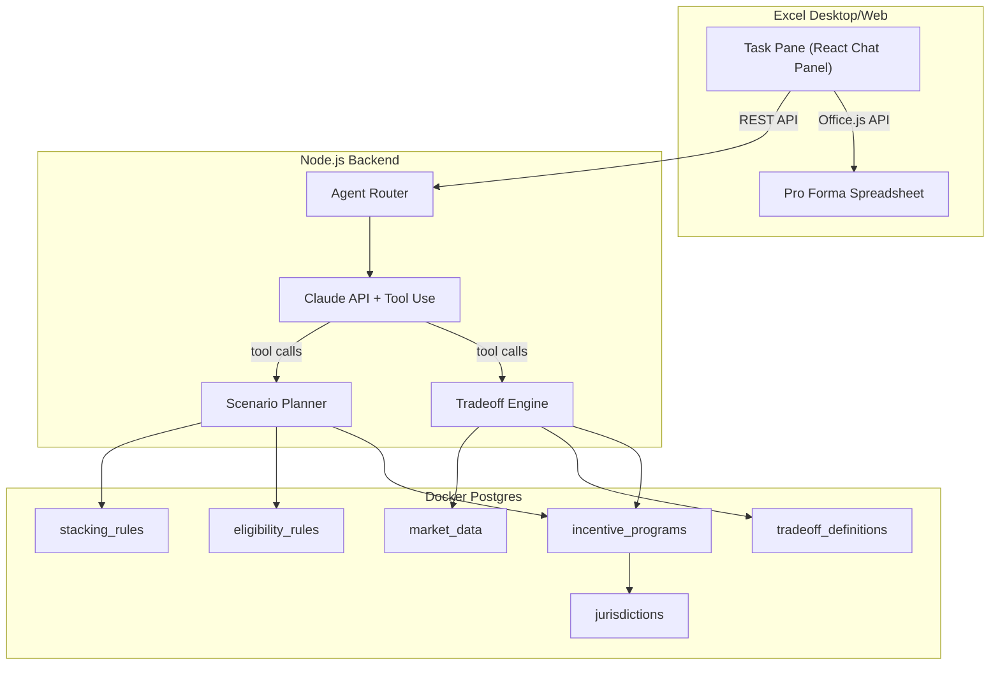
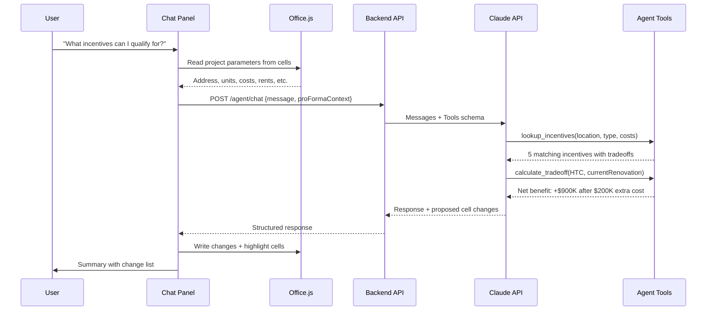
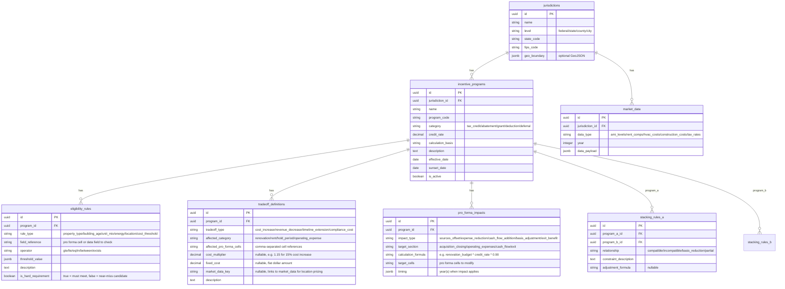
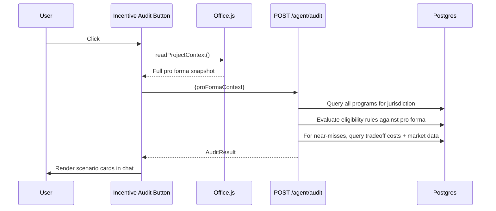
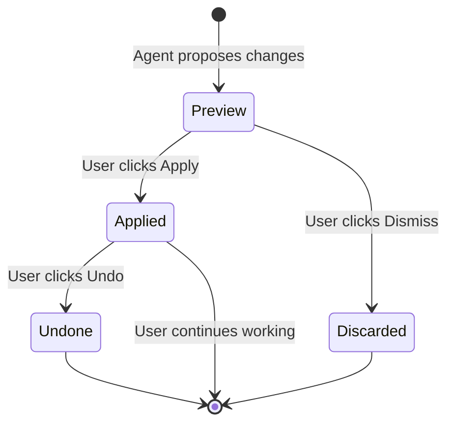

# Incenta Excel Add-in Demo

## Design System

Color palette (used across task pane UI, cell annotations, and chat components):

- **Primary** `#606165` (96,97,101) -- headers, primary buttons, agent message backgrounds
- **Secondary** `#727074` (114,112,116) -- secondary text, borders, input fields
- **Surface** `#aea9a4` (174,169,164) -- card backgrounds, hover states
- **Muted** `#969a98` (150,154,152) -- disabled states, dividers, timestamps
- **Warm** `#928888` (146,136,136) -- accent highlights, active states, incentive value badges

Cell annotation colors (derived from palette):

- **Beneficial change** -- `#928888` border (warm accent) with light fill
- **Tradeoff cost** -- `#606165` border (primary dark) with light fill
- **New line item** -- `#727074` border (secondary) with light fill
- **Preview/pending** -- `#aea9a4` dashed border

## Architecture




## Data Flow: How a Chat Interaction Works




## Project Structure

```
incenta-v2/
  docker-compose.yml              # Postgres + pgAdmin
  addin/
    manifest.xml                  # Office Add-in manifest
    webpack.config.js
    package.json
    tsconfig.json
    src/
      taskpane/
        index.html                # Task pane HTML shell
        index.tsx                 # Entry point
        App.tsx                   # Main app with chat layout
        theme.ts                  # Color palette constants
        components/
          ChatPanel.tsx           # Chat message list + input
          MessageBubble.tsx       # Individual chat messages
          IncentiveCard.tsx       # Rich incentive display card
          TradeoffView.tsx        # Cost vs. benefit visualization
          ScenarioComparison.tsx  # Before/after returns comparison
          IncentiveAuditButton.tsx # "Incentive Audit" one-click button
          AuditResults.tsx        # Qualified + near-miss scenario cards
          CellChangeAnnotation.tsx # Cell change indicator in chat
          ChangelogPanel.tsx      # Collapsible list of all cell changes
        services/
          excel.ts                # Office.js read/write + change tracking
          cellAnnotator.ts        # Excel comments + conditional formatting
          api.ts                  # Backend API client
        types/
          index.ts                # Shared TypeScript types
  server/
    package.json
    tsconfig.json
    prisma/
      schema.prisma               # Normalized DB schema
      seed.ts                     # Denver demo data seeder
      migrations/                 # Prisma migrations
    src/
      index.ts                    # Express server entry
      routes/
        agent.ts                  # POST /agent/chat endpoint
        audit.ts                  # POST /agent/audit endpoint
      services/
        claude.ts                 # Anthropic Claude API with tool use
        mockAgent.ts              # Hardcoded demo responses (fallback)
        tools.ts                  # Tool definitions and handlers
        incentiveDb.ts            # Prisma queries for incentive lookup
        tradeoffEngine.ts         # Net cost/benefit calculator
        scenarioPlanner.ts        # Generates modified pro forma scenarios
        marketData.ts             # Location-aware pricing from Postgres
```

## Core Components

### 1. Office Add-in Scaffolding

- **manifest.xml**: Declares the add-in with task pane entry point, permissions (`ReadWriteDocument`), and supported hosts (Excel).
- **webpack.config.js**: Bundles the React app with HTTPS dev server (required by Office Add-ins). Uses `office-addin-dev-certs` for local SSL.
- Sideloaded into Excel via `npx office-addin-debugging start manifest.xml`.

### 2. Postgres Database (Normalized Schema)

Docker Compose spins up Postgres 16. Prisma ORM manages the schema and queries.




This schema supports:

- Adding new municipalities by inserting a `jurisdiction` row and its associated programs, rules, and market data
- Flexible eligibility rules with different operators (so LIHTC "20% of units at 80% AMI" and HTC "building age >= 50 years" use the same table)
- Market data keyed by jurisdiction for location-aware tradeoff calculations
- Stacking rules as an explicit join table between program pairs

### 3. Chat Panel UI (Cursor-style)

The task pane is a React app with a chat interface, styled with the Incenta color palette:

- **Fixed header** (`#606165` bg): Project name auto-detected from spreadsheet, Incenta logo
- **Incentive Audit button** (`#928888` accent): Prominent button at top of chat -- one click triggers full pro forma analysis
- **Message list**: Scrollable, supports rich cards (incentive cards, tradeoff views, scenario comparisons, change logs)
- **Input bar** (`#727074` border): Text input + send button at the bottom
- **Quick actions**: Contextual buttons that appear after audit results (e.g., "Apply This Scenario", "Explore Tradeoffs", "Undo Changes")

Message types:

- `text` -- Plain text from user or agent
- `incentive_card` -- Rich card showing an incentive with qualification status, value, and tradeoff costs
- `audit_results` -- Multi-scenario view: one "Current Qualifications" scenario + multiple "Near Miss" scenarios with gap descriptions
- `tradeoff_analysis` -- Side-by-side cost vs. benefit breakdown
- `scenario_comparison` -- Before/after table showing IRR, EM, CoC, DSCR, equity needed
- `cell_changelog` -- Expandable list of every cell changed with old/new values and reasons

### 4. Excel Service (`excel.ts`) + Cell Annotator (`cellAnnotator.ts`)

**excel.ts** -- Core Office.js wrapper:

- `**readProjectContext()`**: Reads key cells from the Stable sheet to extract project parameters: address (V15), units (V20), purchase price (F14), renovation (F16), rents (from Unit Mix L14:L18), expenses (F55:F65), financing (F77-F99), exit assumptions (F117-F125).
- `**writeCellChanges(changes: CellChange[])`**: Writes an array of `{sheet, cell, value}` inside a single `Excel.run()` for atomicity. Before writing, snapshots current values.
- `**undoLastChanges()`**: Restores snapshot values and removes all annotations.

**cellAnnotator.ts** -- Rich cell annotations (the "Cursor diff" experience for Excel):

This is the key UX differentiator. When the agent modifies cells, each changed cell gets two layers of annotation:

**Layer 1: Threaded Comments (red triangle indicator)**

Each modified cell gets an Excel comment via the Comments API containing structured change info:

```
[Incenta] Federal HTC
$600,000 -> $690,000
+15% for historically appropriate materials
Net impact on IRR: +3.2pp
```

Users get the native Excel hover-to-see-detail experience. Comments are prefixed with `[Incenta]` so they can be bulk-cleared later.

**Layer 2: Color-Coded Left Borders (gutter-style annotation)**

Changed cells get a thick left border from the Incenta palette using conditional formatting:

- `#928888` (warm) 3pt left border -- beneficial changes (credits, cost reductions)
- `#606165` (primary) 3pt left border -- tradeoff costs (renovation increases, rent reductions)
- `#727074` (secondary) 3pt left border -- new line items (added incentive entries)
- `#aea9a4` (surface) dashed left border -- preview/pending (before user clicks "Apply")

The thick left border mimics a "gutter annotation" similar to how Cursor shows diffs, making changed cells immediately visible without overwhelming background fills.

**Layer 3: Section Summary Comments**

When multiple cells in a section change (e.g., 5 expense cells), the section header cell (e.g., B54 "Expenses") gets a rollup comment:

```
[Incenta] 5 cells modified in this section
Net impact: -$125,000/yr (Property Tax Abatement)
```

### 5. Agent Backend with Claude Tool Use

The backend exposes two main routes:

- `POST /agent/chat` -- Conversational agent with tool use
- `POST /agent/audit` -- One-click Incentive Audit (see section 7)

Chat route sends conversation to Claude with the following tools:

**Tool: `lookup_incentives`**

- Input: `{location, propertyType, projectCost, unitCount, yearBuilt, conversionType}`
- Returns: List of incentive programs with eligibility status, estimated value, and qualification requirements
- Source: Postgres `incentive_programs` + `eligibility_rules` tables via Prisma

**Tool: `check_qualification_gap`**

- Input: `{incentiveId, currentProForma}`
- Returns: What specific changes are needed to qualify (e.g., "Need 20% of units at 80% AMI for LIHTC", "Need Energy Star HVAC for 45L credits")
- This is the key tool for tradeoff awareness

**Tool: `get_market_data`**

- Input: `{location, dataType}` (dataType: "rent_comps", "hvac_costs", "construction_costs", "ami_levels", "property_tax_rates")
- Returns: Location-specific pricing data
- Source: Postgres `market_data` table (seeded with Denver data for demo; real API ingestion later)

**Tool: `calculate_tradeoff`**

- Input: `{incentiveId, currentProForma, requiredChanges}`
- Returns: `{additionalCosts, incentiveValue, netBenefit, affectedCells, impactOnReturns}`
- This computes the full picture: "You spend $200K more on HVAC, but get $500K in 45L credits, net +$300K, IRR goes from 14% to 17%"

**Tool: `generate_scenario`**

- Input: `{baseScenario, incentivesToApply[], targetScenarioColumn}`
- Returns: Complete set of cell changes to write to the spreadsheet, including: modified rents (if LIHTC), modified renovation costs (if energy/historic), new incentive rows, adjusted financing
- This is what enables proactive scenario planning

**Tool: `compare_scenarios`**

- Input: `{scenarioA_cells, scenarioB_cells}`
- Returns: Side-by-side comparison of IRR, equity multiple, CoC, DSCR, total equity needed, NOI

### 6. Incentive Database (Postgres Seed Data)

The `prisma/seed.ts` script populates the database with Denver demo data:

**Jurisdictions** (3 rows):

- Federal (US)
- State of Colorado
- City & County of Denver

**Incentive Programs** (8 rows, all relevant to hotel-to-residential conversion):

- Federal Historic Tax Credit (20%)
- Colorado State Historic Tax Credit (25%)
- Opportunity Zone (capital gains deferral/exclusion)
- Section 45L Energy Efficient Home Credit ($2,500-$5,000/unit)
- Section 179D Energy Efficient Commercial Building Deduction
- Denver Property Tax Abatement for conversions
- Colorado Enterprise Zone Tax Credit
- LIHTC 4% (bond-financed projects)

**Eligibility Rules** (~25 rows): Each program has 2-5 rules. Examples:

- HTC: `{rule_type: "building_age", operator: "gte", threshold: 50, is_hard: true}`
- LIHTC: `{rule_type: "unit_mix", operator: "gte", threshold: {"pct_units_at_ami": 0.20, "ami_level": 0.80}, is_hard: true}`
- 45L: `{rule_type: "energy", operator: "eq", threshold: "energy_star_certified", is_hard: true}`

**Tradeoff Definitions** (~12 rows): Each program's cost implications:

- HTC: `{type: "cost_increase", category: "renovation", multiplier: 1.15, market_data_key: "historic_materials_premium"}`
- LIHTC: `{type: "revenue_decrease", category: "rent", affected_cells: "Unit Mix!L14:L18", market_data_key: "ami_rent_limits"}`
- 45L: `{type: "cost_increase", category: "renovation", market_data_key: "hvac_energy_star_premium"}`

**Stacking Rules** (~10 rows): Pairwise compatibility:

- HTC + OZ: compatible
- HTC + LIHTC: compatible (but basis reduction applies)
- 45L + 179D: incompatible (cannot claim both on same property)

**Market Data** (Denver, ~6 rows):

- AMI levels by household size (2025)
- HVAC costs: standard ($8K/unit) vs. Energy Star ($12K/unit) vs. high-efficiency ($15K/unit)
- Construction costs: $150-$250/SF by quality tier
- Property tax mill levy: 7.96%
- Historic materials premium: 15-25% over standard

### 7. Incentive Audit (One-Click Feature)

This is the flagship UX feature. When the user clicks the "Incentive Audit" button:




The audit returns an `AuditResult` with three tiers:

**Tier 1: "Currently Qualified"** -- Incentives the project qualifies for today with no changes. Shows one scenario card with: all qualifying incentives stacked, total value, net impact on IRR/EM/CoC. User can click "Apply This Scenario" to write changes.

**Tier 2: "Near Miss"** -- Incentives the project almost qualifies for. Each near-miss gets its own scenario card showing:

- Which rules fail and by how much (e.g., "LIHTC: Need 40 units at $1,120/mo vs. current $1,400")
- Required pro forma changes with tradeoff costs
- Net benefit after accounting for tradeoff costs
- "What If" button to apply this scenario to a new column

**Tier 3: "Not Applicable"** -- Programs that don't apply (e.g., New Markets Tax Credit for a residential project). Shown collapsed at the bottom for transparency.

The user can then chat with the agent to refine any scenario: "What if we only do 30 LIHTC units instead of 40?" or "Can we combine the HTC scenario with the property tax abatement?" The agent uses the same tools to recalculate and propose updated changes.

### 8. Tradeoff Engine (`tradeoffEngine.ts`)

For each incentive, computes:

```
Net Impact = Incentive Value - Sum(Qualification Costs)
```

Where qualification costs are sourced from `tradeoff_definitions` + `market_data` tables in Postgres:

- **LIHTC tradeoff**: Queries `market_data` for Denver AMI rent limits by unit type, compares to current rents in Unit Mix sheet, calculates annual revenue loss * hold period
- **Energy credit tradeoff**: Queries `market_data` for Denver HVAC pricing (standard vs. Energy Star), computes per-unit cost delta * unit count, adds to renovation budget
- **HTC tradeoff**: Uses `tradeoff_definitions.cost_multiplier` (1.15) applied to renovation budget, queries `market_data` for historic materials premium in Denver
- **OZ tradeoff**: Compares current exit year (Stable Row 117) to required 10-year hold, calculates NPV impact of extended timeline

Each tradeoff returns `affectedCells[]` with `{sheet, cell, oldValue, newValue, reason, category}` for both the chat changelog and cell annotations.

### 9. Change Tracking Flow

The full lifecycle of an agent-proposed change:




**Preview state**: Dashed `#aea9a4` left borders on affected cells. Comments added with `[Incenta Preview]` prefix. Chat shows changelog with "Apply" and "Dismiss" buttons.

**Applied state**: Solid colored left borders (`#928888`/`#606165`/`#727074`). Comments updated to `[Incenta]` prefix. Section summary comments added. Snapshot stored for undo.

**Undo**: Restores all cell values from snapshot, removes all `[Incenta]` comments and border formatting in a single `Excel.run()` batch.

## Demo Walkthrough

The demo showcases the full user journey using the masked template (`proforma_template_MASKED.xlsx`):

**Phase 1: Auto-Detection**

1. User opens the masked template in Excel, clicks "Incenta" in the ribbon to open task pane
2. Task pane auto-reads the spreadsheet: "I see a 200-unit hotel-to-residential conversion at 1234 Example Blvd, Anytown, CO. Purchase price $7M, renovation budget $600K."

**Phase 2: Incentive Audit (one-click)**
3. User clicks the "Incentive Audit" button
4. Audit results render in the chat as scenario cards:

- **Currently Qualified**: Denver Property Tax Abatement + Colorado Enterprise Zone Credit. Combined value: ~$850K. "Apply This Scenario" button.
- **Near Miss #1**: Federal HTC (building needs National Register listing verification). Gap: "Confirm historic designation". Tradeoff: +$90K renovation. Net benefit: +$990K.
- **Near Miss #2**: LIHTC 4%. Gap: "Need 40 units at 80% AMI ($1,120/mo vs current $1,400)". Tradeoff: -$134K/yr revenue. Net benefit: +$1.6M equity after 10-year NPV.
- **Near Miss #3**: Section 45L. Gap: "Need Energy Star HVAC". Tradeoff: +$800K HVAC upgrade (from market data). Net benefit: +$200K after costs.

**Phase 3: Conversational Refinement**
5. User: "What if we only convert 30 units to LIHTC instead of 40?"
6. Agent recalculates: reduced revenue loss, but also reduced LIHTC equity. Shows updated tradeoff.
7. User: "Let's go with HTC + property tax abatement. Write it to Scenario 2."

**Phase 4: Apply with Annotations**
8. Agent writes to Scenario 2 column (H) in the Stable sheet. In Excel:

- 14 cells get thick `#928888` left borders (beneficial: tax credit equity, reduced taxes)
- 3 cells get thick `#606165` left borders (tradeoff: increased renovation costs)
- Each cell has a red triangle comment with change details
- Section headers (B13 "Acquisition", B54 "Expenses") get summary comments

1. Chat panel shows: "Applied 17 changes to Scenario 2. Scenario 2 IRR: 19.2% (vs. Scenario 1: 12.8%). Equity Multiple: 2.1x (vs. 1.7x)."
2. User can click "Undo" to revert all changes instantly.

